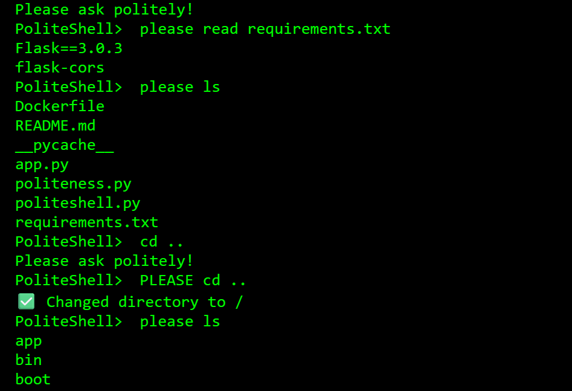

# PoliteShell

A Linux/Bash style command line shell where you're forced to be nice

Rude requests are rejected while courteous ones will execute

Run politeshell.py to use the wrapper for your own system

Or connect to the public server to see what others are changing:

https://politeshell.onrender.com/

---

## Features

- Detects polite phrases automatically
- Accepts commands like `please ls`, `could you mkdir folder` and many more.
- Gives feedback based on your politeness level

---

## How to Run

```bash
cd PoliteShell
python politeshell.py

```

or use the deployed server:

https://politeshell.onrender.com/

---

## Requirements

- Must have Linux, Windows Subsystem for Linux, etc.

---

*Created by William Rongerude*
