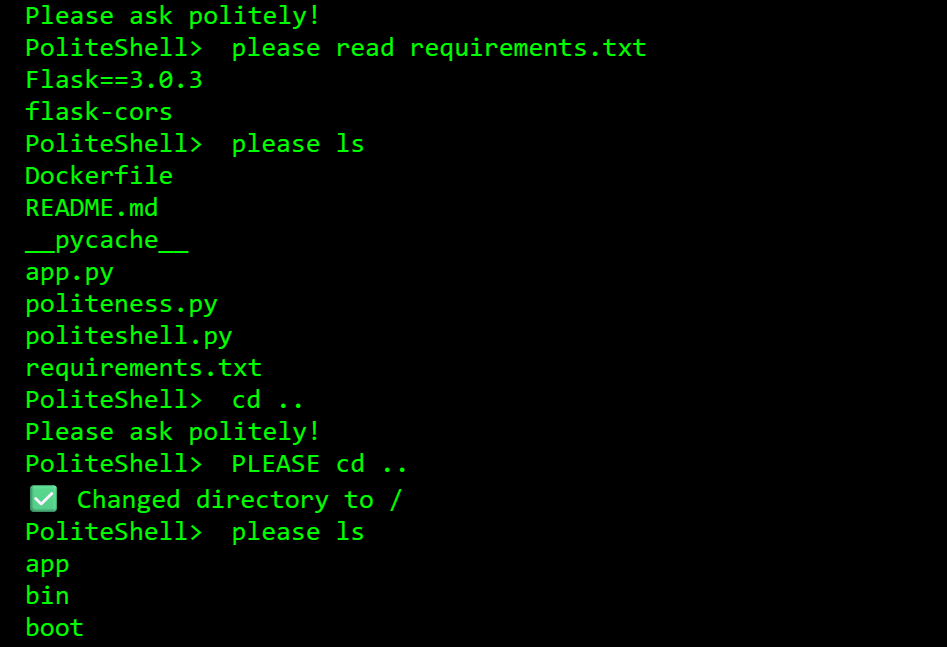

# Polite Shell

This shell requires that you be nice or use courteous language. Most messages with the sentiment of 'please' will work, such as saying 'can you do this', 'may you', 'please', etc.

Run politeshell.py to use this wrapper for your own system, or connect to the public server:

https://politeshell.pages.dev/

---

## Features

- Detects polite phrases automatically
- Accepts commands like `please ls`, `could you mkdir folder` and many more.
- Gives feedback based on your politeness level

---

```bash
cd Polite-Shell
python politeshell.py

```

---

## Requirements

- Must have Linux, Windows Subsystem for Linux, etc.

---


